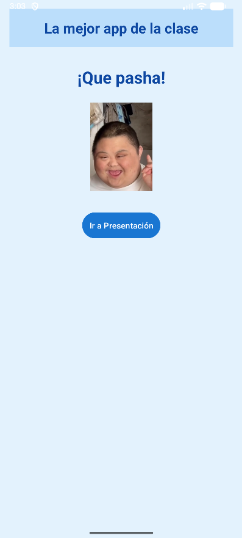
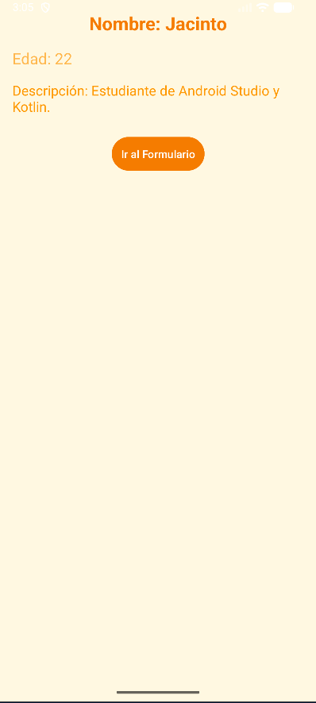
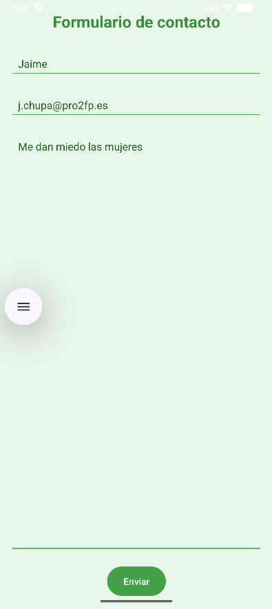

# Proyecto Android: Formulario Interactivo

## Descripción General
Esta aplicación Android está desarrollada en Kotlin con Android Studio.  
El objetivo es practicar la navegación entre pantallas y el uso de un formulario con validaciones básicas.

La app tiene tres pantallas principales:
1. MainActivity → Pantalla inicial con logo y botón para continuar.  
2. PresentationActivity → Pantalla de presentación con datos de usuario.  
3. FormularioActivity → Formulario donde se introducen y validan datos del usuario.
4. ConfirmacionActivity → Pantalla donde salen los datos guardados con exito los datos del usuario.

---

## Pasos para abrir y ejecutar el proyecto

1. Abrir Android Studio.  
2. Seleccionar la opción "Open an Existing Project".  
3. Buscar y abrir la carpeta del proyecto Projectoeva1.  
4. Esperar a que se sincronicen las dependencias (Gradle).  
5. Conectar un dispositivo físico o iniciar un emulador.  
6. Pulsar "Run" para ejecutar la aplicación.  

---

## Validaciones implementadas

En la pantalla del Formulario, se incluyen las siguientes validaciones:

- Campo nombre: No puede estar vacío.  
- Campo correo electrónico: Debe contener un formato válido (usuario@dominio.com).  
- Campo edad (si aplica): Solo permite números y no puede ser menor o igual a cero.  
- Si algún campo no cumple las condiciones, se muestra un mensaje de error (Toast).

Estas validaciones se realizan antes de procesar la información, para asegurar que los datos ingresados por el usuario sean correctos.

---

## Capturas de pantalla

### Pantalla Principal (MainActivity)

### Pantalla de Presentación (PresentationActivity)

### Pantalla del Formulario (FormularioActivity)

### Pantalla de DatosGuardados (DatosGuardados)

Guarda tus capturas dentro de una carpeta llamada "images" en la raíz del proyecto con esos nombres.

---

## Autor
Nombre: Daniel Martin Lopez  
Curso: DAM  
Año: 2025  
